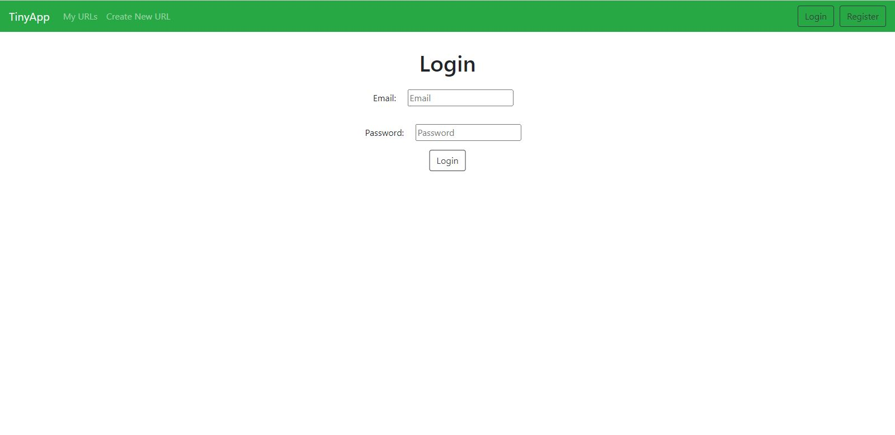
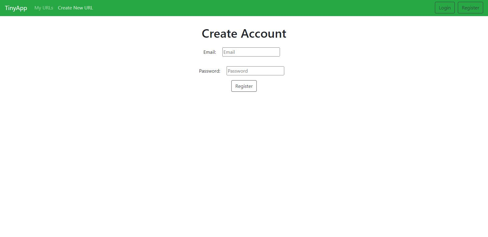
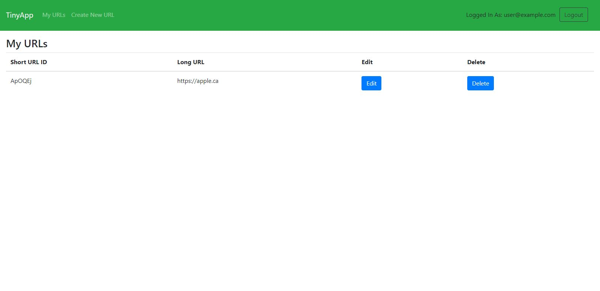

# TinyApp Project

TinyApp is a full stack web application built with Node and Express that allows users to shorten long URLs.

## Final Product

## Dependencies
- bcryptjs
- cookie-session
- Express
- EJS
- Node.js
- mocha (test cases)
- chai (test cases)

## Getting Started

- Install all dependencies (using the `npm install` command).
- Run the development web server using the `npm start` command.
- You can use `npm test` to run tests and you can add your own test on  `tests` directory.
- Enjoy shortening your URLS.